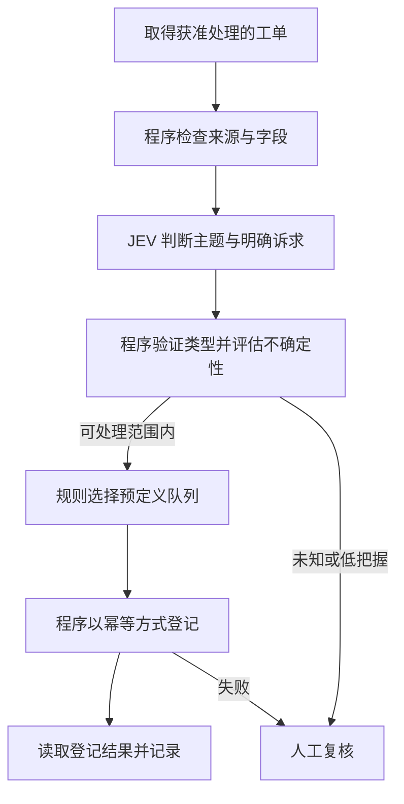

# 从辅助走向自动化：创始人演讲精读与项目修订

阅读日期：2026-09-21。依据用户提供的中文内嵌字幕整理稿逐节阅读，并与当前 TypeSafe 官方资料及 InstructGPT 原论文交叉核对。本文为独立分析与转述，不转载字幕全文。

来源：[原视频入口](https://www.youtube.com/watch?v=cJ0EOzey--o)。本次未完成英文音轨逐句复听；视频页面抓取受限。时间戳沿用字幕稿，不能当作经过原声审定的直接引语。整理日期不等于演讲发生日期。

## 1. 演讲的主线：模型为谁、为什么结果而优化

演讲从一种反差切入：AI 在某些基准上很强，但企业仍不能轻易把日常工作放心交出去。Diogo 在 04:30–08:33 给出的解释，是辅助型产品与无人值守软件对结果的要求不同；他把这一差异追溯到训练目标。

在 09:51–12:15，他把问题推进了一步：AI 让代码更容易写出来，但软件本身是否因此获得了新的判断能力？到了 12:23–17:17，他提出 TypeSafe 的方向：围绕可靠自动化和可校准决策重新设计模型及接口。

我的理解是，这场演讲的中心不是“模型不输出句子”，而是**软件是否能用一种可检验的接口接入语义判断，并根据实际结果持续检验它**。速度和成本决定可用范围，不能替代这个核心条件。

## 2. 对经营者最有价值的五层理解

### 第一层：满意和完成需要分别衡量

老板觉得 AI 回答清楚，并不等于日报数字已核对、订单已处理或消息已送达。这两种结果可以同时成立，也可以分离。

因此，试点验收应写成“目标结果 + 可读取证据”，而不是“回答看起来很专业”。当前 v0.1 的证据摘要复核，就是这一思想的一个窄应用。

### 第二层：把重复工作拆到适合程序处理的尺度

演讲 11:46–12:03 提到的机械重复工作，不必等同于整份岗位职责。对中小企业更实际的起点，是一件反复出现、能明确检验的工作。

例如“这条留言是否明确要求退款”是语义判断；“订单是否存在、是否已退过、付款金额是多少”应由数据库和程序给出；“是否实际退款”还要经过业务政策与授权。把三个层次合成一个“AI 觉得可以退”会丢失重要约束。

### 第三层：校准让不确定性可以被利用，但不能变成担保

校准描述一组预测与现实频率的关系。假设有足够多相近案例，被赋予约 0.8 概率的事件应在约 80% 的案例中发生。这是教学解释，不是本项目测得的结果。

它不意味着一个 confidence=0.8 的请求有经过验证的 80% 正确率。官方 Choice/Score 的 confidence 是分布统计量，不能直接当作事件概率；不同任务、输入来源和时间段还需要分别检验。[TypeSafe 校准说明](https://docs.typesafe.ai/introduction/machine-learning-primer)、[Confidence](https://docs.typesafe.ai/confidence)。

即使单个判断经过校准，多步流程仍可能发生累计错误和相关错误。因此真正的验收单位应是完整业务结果，并保留不确定、未知和人工处理路径。

### 第四层：Harness 的核心是约束与验收合同

把 JEV 放到每次工具调用前，不自动产生可靠系统。需要先定义：允许问哪些问题，输入证据从哪里来，输出如何校验，哪些规则必须由代码执行，失败后谁接手，以及什么回执才算完成。

当前实现覆盖输入约束、输出校验、调用额度、失败回退和摘要复核。它没有运行时工具拦截、业务状态机、幂等执行或自动回滚，因此不能据此宣称已经获得无人值守自动化。

### 第五层：经营价值取决于整条流程

便宜的小判断值得试用，但仍可能增加调用、等待与误拦。评估需要把模型费、人工复核、异常处理、错误损失和维护工作放到一起看。

经营者真正需要的问题是：在结果质量可接受的前提下，每一件真正完成的工作，需要自己介入多少次？这个指标是我们的项目设计推论，不是创始人演讲已经验证的结论。

## 3. 一个影响项目定位的重要张力

项目叫 Agent + JEV Harness，容易让人以为终点是让大模型持续调度，再多问几个小模型。可是当前 [TypeSafe 官方构建指南](https://docs.typesafe.ai/concepts/how-to-build-with-system-one) 强调由程序掌握控制流，模型仅负责需要语义理解的小判断。

因此我们应把两种用途分清楚：

| 路线 | 适用条件 | 本项目位置 |
|---|---|---|
| Agent 辅助 + JEV 复核 | 任务多变，流程还在摸索，人需要协作 | v0.1 已实现的通用入口 |
| 程序流程 + JEV 小判断 | 输入、规则和验收已稳定，可以定义状态转换 | 后续试点方向，尚未实现 |

推荐的演进方式：经营者和 Agent 先把工作做通，提炼重复部分，再将稳定流程写成程序；JEV 只留在纯规则难以处理的语义位置。Agent 可以继续承担流程设计、异常调查和维护，但不必参与每一次正常业务执行。这是我们的架构建议，不是官方已证明适用于所有企业的路线。

## 4. 哪些说法要保留意见属性

| 字幕中的观点 | 本次如何处理 |
|---|---|
| 优化人类偏好不等于优化无人值守结果 | 值得用于提出验收问题；不据此否定所有生成模型自动化 |
| RLHF 模型必然过度承诺、所有幻觉都来自该目标 | 演讲者的强因果论断；本次资料不足以确立普遍因果结论 |
| 所有当前 LLM 几乎都用 RLHF，且终局是参与度 | 不采纳为行业事实；缺少覆盖模型与时间范围的证据 |
| 软件从 2019 年起基本没变 | 演讲修辞与概括，不能直接用于市场研究结论 |
| 新技术栈优化校准过的决策 | 当前官方将该方向称为 RLCD；名称与目标可确认，优势仍需独立评估 |
| 团队发明后训练 / 个人提出 RLHF | 本次只确认 Diogo 为 InstructGPT 论文合著者，不扩大到唯一发明者 |
| Sutton 认为算法比算力重要 | 字幕稿本身已标待核对；本次原文站点访问失败，不作为可靠引语 |
| RLVR 的目标是“纯正确性的对数错误率” | 译词未审定，不据此推断数学损失函数 |

一个有价值的反向核对：InstructGPT 原论文报告了真实性方面的改善，同时承认模型仍犯简单错误。这足以提醒我们，不能把“偏好训练”简化成“只训练讨好”，也不能从宣传叙事推出 JEV 自动免疫同类问题。[原论文及作者列表](https://arxiv.org/abs/2203.02155)。

演讲中关于发布在即的表述也属于演讲当时的状态。当前 API 已可实际调用，本项目已做独立合成验证，二者不能混成同一时间点。

## 5. 用客服分流说明未来的程序流程

以下为设计示意，尚未实现：

在这个场景中，JEV 判断“说的是什么”，程序决定“下一步怎么做”，经营者设定“哪些事情可以自动处理”。退款、对客承诺和客户触达不由分类结果自动授权。

## 6. 这次具体修改了什么

1. 将项目总定位扩展为“把可验证的小判断接进企业工作流程”。
2. 保留 v0.1 的开工分流与交付复核，并明确这是辅助入口，不等于自动化终态。
3. 在后续路线中加入一个由代码掌握流程的窄业务试点，要求可核验结果和人工对照。
4. 将“更少盯过程、结果可核验”作为经营者的评估问题，撤去速度倍率和零幻觉式承诺。
5. 保留中文稿的翻译疑点；公开说明采用独立转述，不复制私人资料或字幕全文。

## 7. 分享开场可以这样说

“我们想做一个很小的实验：挑公司里每天反复做的一件事，把什么叫做好写清楚。先让 AI 助手把流程跑通，再把稳定的部分交给程序。程序遇到必须理解一句话的小问题时，可以问 JEV；结果不明确就交回给人。我们公开这套接法，也公开哪些有效、哪些没验证。最终看的是你少盯了多少次，事情有没有真正办完。”
